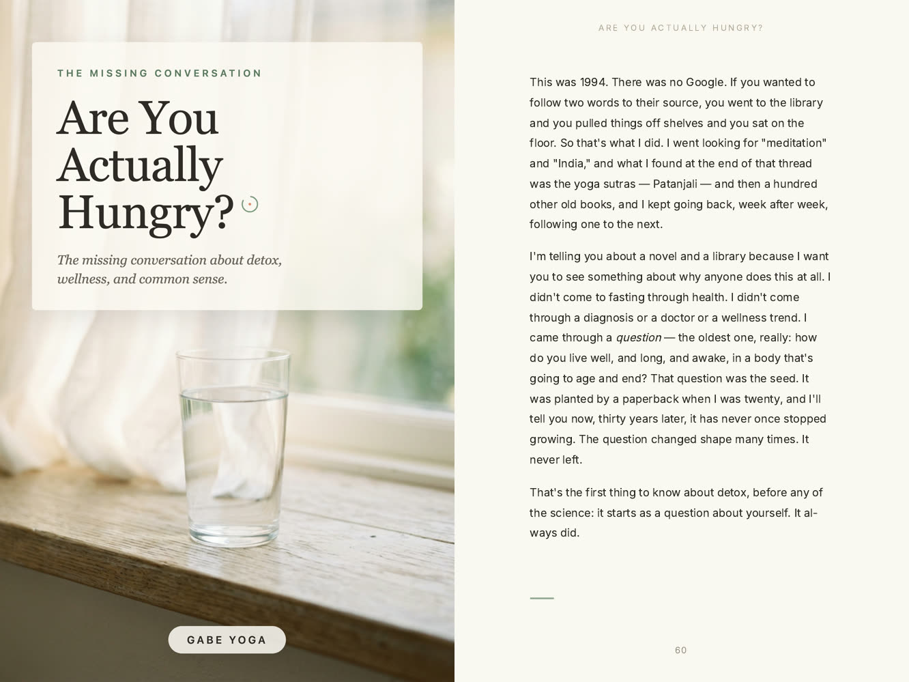

# Publishing Preparation

A folder-based ICM specialist that takes a finished, revision-passed manuscript and produces the actual retail/delivery artifacts a publishing channel requires — without ever touching the prose itself.

This formalizes two production pipelines that were built independently, for the same problem, by different sessions that didn't know the other existed — and have shipped, between them, five real books. It is not a theory of book layout; it's a repeat of what already worked, twice.

## What it produces

An example from a real book: the front cover and page 60 of the 340-page interior PDF for *Are You Actually Hungry?*, rendered with `pagedjs-cli`. The running head at the top of the page and the page number at the bottom come from the `@page` rules in the book's `print.css`, which is why the skill requires `pagedjs-cli`.

The full package for that book is six files: front cover PNG, back cover PNG, PDF, EPUB, DOCX and a stripped Markdown master (see `reference/output-packaging.md`).

## What this is

Two proven pipelines, chosen by what already exists for the book:

1. **CSS Paged Media** — fresh markdown chapter source, a build script that parses it into structured components, rendered via `pagedjs-cli` (never Chrome headless — it silently drops running heads and page counters). Read directly from the *"Are You Actually Hungry?"* production trail.
2. **Structural Template** — an existing finished book's HTML/CSS in the family, copied as the template for a new one, class names kept intact. Read directly from the JDM book system, used across four books.

Both converge on the same proven output: a six-file retail package (front cover PNG, back cover PNG, full PDF, EPUB, DOCX, stripped Markdown master) plus a packaging README, checked against current KDP/IngramSpark trim/bleed/margin/barcode requirements before shipping.

Full detail per pipeline: `reference/`.

## Setup

1. Load this folder into a Claude Project, or point a Claude Code session at it — `SKILL.md` lets Claude Code auto-discover and trigger it from a natural request (e.g. "the manuscript's done, lay it out for print"); it routes to `identity.md` → `rules.md`, then to the one `reference/` file the active pipeline needs.
2. Working from the raw files directly (no `SKILL.md` support): read `identity.md` → `rules.md` → `examples.md` in that order, then open only the `reference/` file for the pipeline actually in use.
3. Confirm the manuscript has completed `book-ghostwriting-skill`'s Stage 5 (named revision passes) before starting — this specialist refuses to lay out anything still in revision.

## First-run prompts

- *"The manuscript's done and revision-passed. Here's the markdown source — lay it out for print."*
- *"Here's [prior book]'s finished HTML — copy it as the template for the new book."*
- *"Why did the running heads disappear from this PDF?"*
- *"Package this book for KDP."*

## What this specialist does and doesn't do

See `identity.md` and `rules.md` for the full contract. In short: it never touches manuscript prose, never invents cover creative direction, never chases an ISBN, and never writes retail-listing copy — it owns trim, margins, running heads, pagination, the component library, and the six-file retail package, using one of two pipelines that already shipped five real books.

Image and extra-format work goes to [Book Format & Interior-Image Integrity](https://github.com/NFTYoginis/book-format-integrity-skill). It takes this package and its source as input and checks that the images inside it, and any other format made from it, carry the same images.

## Where this fits

The book-production shelf, numbered as in the catalog. The skill in this repo is in bold.

1. [Book Ghostwriting](https://github.com/NFTYoginis/book-ghostwriting-skill)
2. **Publishing Preparation** (this repo)
3. [Title & Positioning](https://github.com/NFTYoginis/title-and-positioning-skill)
4. [Book-to-Content Repurposing](https://github.com/NFTYoginis/book-to-content-repurposing-skill)
5. [Fact, Claim & Evidence Verification](https://github.com/NFTYoginis/fact-claim-verification-skill)
6. [Book Launch & Funnel Strategy](https://github.com/NFTYoginis/book-launch-funnel-strategy-skill)

Previous: [Book Ghostwriting](https://github.com/NFTYoginis/book-ghostwriting-skill) · Next: [Title & Positioning](https://github.com/NFTYoginis/title-and-positioning-skill). All six: [Book Production Skills](https://github.com/NFTYoginis/book-production-skills).

## License

MIT — see `LICENSE`.

---

Built by Gabe at The Quiet Ai. The Quiet Scribe Suite (early access) carries your context from one AI tool to the next: [thequietscribe.com](https://thequietscribe.com)
